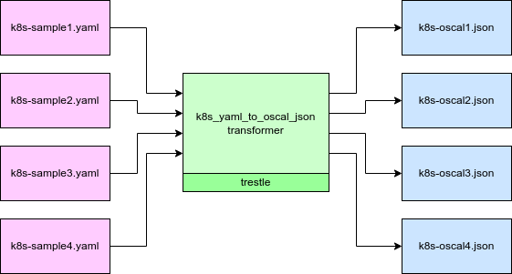

# k8s-to-oscal

*k8s-to-oscal.py* is a [trestle](https://github.com/IBM/compliance-trestle) based transformer from [Kubernetes YAML](https://github.com/kubernetes-sigs/wg-policy-prototypes) to [OSCAL JSON](https://pages.nist.gov/OSCAL/reference/latest/assessment-results/json-outline/).

Use *k8s-to-oscal.py* to consume k8s yaml results files and produce OSCAL assessment results json.

A [spreadsheet](Kubernetes-Yaml-to-OSCAL-Mapping.xlsx) shows the mapping from YAML to OSCAL.

Sample inputs can be found [here](https://github.com/kubernetes-sigs/wg-policy-prototypes/tree/master/policy-report/samples). Sample outputs can be found [here](https://github.com/kubernetes-sigs/wg-policy-prototypes/tree/master/policy-report/oscal-transformer/oscal-samples).

#### Prerequisites

Python 3.7, 3.8, or 3.9.

```
> python -V
Python 3.9.9
```

#### Exercising the k8s-to-oscal transformer on sample data

Shown in the diagram are two paths for transformation of
k8s yaml to OSCAL json: command line and programmatic.
The demo below employs the command line to produce
OSCAL assessment-results json from k8s yaml samples.



From the current directory where this README is installed, run:

```
> make oscal
=> create python virtual environment venv.trestle
=> install trestle with prereqs
=> create and initialize trestle workspace
=> transform samples from k8s yaml to OSCAL json
>> source venv.trestle/bin/activate
>> python k8s-to-oscal.py --in ../samples --out trestle.workspace/assessment-results
2022/04/13 09:42:25 I created: trestle.workspace/assessment-results/sample-cis-k8s.json
2022/04/13 09:42:25 I created: trestle.workspace/assessment-results/sample-co.json
2022/04/13 09:42:25 I created: trestle.workspace/assessment-results/sample-falco-policy.json
2022/04/13 09:42:25 I created: trestle.workspace/assessment-results/sample-rhacm-policy.json

```

#### Gett k8s-to-oscal transformer help

From the current directory where this README is installed, run:

```
> make help
=> using python virtual environment venv.trestle
>> python k8s-to-oscal.py -h
usage: k8s-to-oscal.py [-h] --input INPUT --output OUTPUT [--ar-type {full,partial}] [--ap-href AP_HREF] [--ns NS]

Transform k8s yaml to OSCAL assessment-results json

optional arguments:
  -h, --help            show this help message and exit
  --input INPUT         input folder containing yaml files to be consumed
  --output OUTPUT       output folder to receive json files produced
  --ar-type {full,partial}
                        OSCAL assessment-results type, default=full
  --ap-href AP_HREF     OSCAL assessment-plan href, default=https://default-assessment-plan
  --ns NS               OSCAL results ontology namespace, default=https://kubernetes.github.io/compliance-trestle/schemas/oscal/ar/scc


```
